# LinearEquationsSolver

## About

You’ve come so far! Yet sometimes it’s nice to get back to old and simple basics: shall we remember some linear algebra? In this project, you will write a program that solves linear equations (you wish you had it back at school, don’t you?) It won’t be working with powers and radicals, but on the other hand, it will be able to handle matrices and complex numbers.

## Learning outcomes

Practice the ever-useful essentials (classes, arrays, files) and learn to handle complex numbers and matrices.

## What you’ll do and what you’ll learn

- [x] [**Stage 1/5: Simple and real**](#stage-15-simple-and-real)  
  Start with real numbers and simple equations of 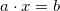 type.
- [x] [**Stage 2/5: X and Y**](#stage-25-x-and-y)  
  Enable the program to solve systems with two variables.
- [x] [**Stage 3/5: Equations**](#stage-35-equations)  
  Practice working with multidimensional arrays, files and the command line: get data from a file and solve multiple linear equations
- [x] [**Stage 4/5: When things get complicated**](#stage-45-when-things-get-complicated)  
  Learn to handle special cases where there is no or infinite possible solutions for the equations.
- [x] **Stage 5/5: Complex numbers**  
  Finally, teach your program to solve equations with complex numbers.

## Demonstration

## **Stage 1/5: Simple and real**

A linear equation is an equation for a straight line, often presented as 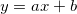. It is called linear because it contains only variables to the power of 1. The ***x*** and ***y*** above are these variables, while ***a*** and ***b*** are called coefficients.

Linear equations can be found in different fields of science and technology. You can find some basic examples here. In this project, you will write a lot more powerful solver, but in this stage, you will start with a simple one.

Write a program that solves the equation .

Numbers ***a*** and ***b*** should be read from the first line of the standard input. You should output the value ***x***, with which the equation is true. For example, if the input contains numbers ***5*** and ***3***, this means that you should interpret this as an equation 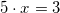. For this example, the answer would be **0.6** since 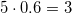.

## **Stage 2/5: X and Y**

Let's solve the problem with one additional variable and one additional equation. The variables would be ***x*** and ***y***. In general this equation would look like this:

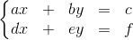

Where ***a, b, c, d, e, f*** are numbers. The general algorithm is to separate the variables so that the first variable is solved in the first line and the second variable is solved in the second line.

The main concept here is to subtract rows. You already know how to subtract numbers and subtraction of rows is pretty similar. Below is an example in which we subtract the first row from the second one.

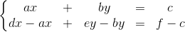

As you can see, we subtract 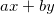 from the left side of the second equation and also subtract  from the right side that equation. Since we subtracted equal amounts from both sides, the equation remains correct. You also can simplify this as shown below:

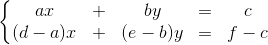

However, this all comes together when you realize you can subtract only a part of an equation. Let's subtract the first equation multiplied by  from the second equation.

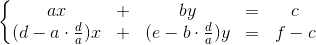

Notice that 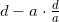 becomes 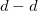 and becomes ***0***. Therefore, we can exclude ***x*** from the second equation.

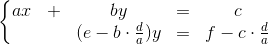

And there we can find the ***y*** value. Just divide both sides by 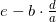.

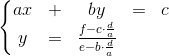

Now, you can find the ***x*** value from the first equation since you know the ***y*** value. This is a similar problem like in the previous stage.

The first line of the input contains numbers ***a, b, c***. The second line of the input contains numbers ***d, e, f***. All 6 numbers are doubles. You should output the solution: ***x*** and ***y*** in a single line.

## **Stage 3/5: Equations**

In this stage, the problem becomes more difficult. You should generalize the solution for any amount of variables. The important part is to understand that in most cases if the number of equations equals the number of variables there is only one solution. We will consider special cases in the next stage.

Such multiple linear equations connected together are called a system of linear equations.

You can see an example of the general system of linear equations below. The variables are named , 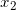, ...,  
The coefficients are named 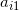, 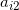, ..., 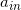 for the *i*-th row. And the constants are named , 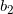, ..., .
 

 
 Firstly, the algorithm should null the first column of coefficients except for the first coefficient, which should be equal to 1. Notice letters **c** and **d** instead of **a** and **b**. It means that through some calculations these coefficients became other coefficients and thus we cannot use letters **a** and **b** since they refer to the initial coefficients.
 
 
 
 After that, you need to null the second column all the way from the third row. The second row should contain the coefficient equal to 1.
 
 
 
 The same goes for the rest of the columns. In the end, you should get something like that:
 
 
 
 The second part of the algorithm is to iterate rows from the last to the first and null the top part of the linear system. In the end, there should be only diagonal elements of the linear system.
 
 
 
 And the right part of the system is the solution to this system.
 
 In this stage, you need to write a program that reads coefficients from a file, solves the system of linear equations, and writes the answer to another file. You should pass paths to files using command-line arguments. Write to the file only answers separated by `\n`. Output all the steps only to the console, not in the file.
 
 The first line of the file should contain the number **N**, a number of variables and also a number of equations. Every other **N** lines contain **N+1** numbers, i.e. **N** coefficients of the current row and a constant as the last number in this line. The program also should output all rows manipulation it is doing when solving a system of linear equations.
 
## Stage 4/5: When things get complicated
 
This stage is devoted to various special cases of the algorithm.
 
Firstly, let's take a look at the first stage of the algorithm. In it you should change the first row in a way that the first element of the row is equal to 1. But what if the first element of the row is 0? Any multiplications of such row would never produce the first element equal to 1 because it would always be 0.
 
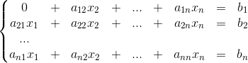
 
Because of that, you need to modify the algorithm. All rules will follow the example of a system of linear equations. The question marks next to the coefficients mean any value. The coefficients highlighted in red mean the ones mentioned in the rule.
 
1. Before scaling the current row you should check if the corresponding element of the row isn't 0.
 
    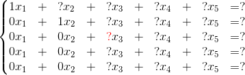
 
2. If the coefficient is zero, the program should look for a non-zero coefficient under this coefficient. If such a coefficient is found in some other row, you should swap that row with the current one. In the example below, rows 3 and 5 have been swapped.
 
    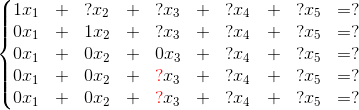
    
    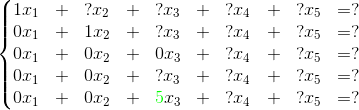
    
    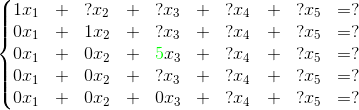
 
3. If all the coefficients below the element are zero, you should look for a non-zero coefficient to the right of the current one. If such a coefficient is found in some other column, you should swap that column with the current one. Don't forget to swap because in the end you need to swap them back to output the solutions in the right order. There could be a lot of swaps. In the example below, rows 3 and 4 have been swapped.
 
    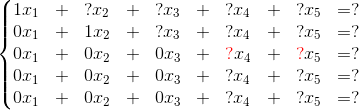
    
    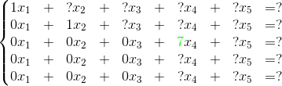
    
    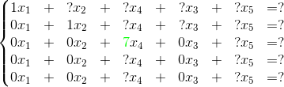
 
4. If all the coefficients below and to the right of the element are zero, you should find the non-zero element in the whole bottom-left part of the linear system. If such a coefficient is found in some other row and column, you should swap both those row and column so that this non-zero element is in place of the current element. Also, don't forget to remember the column's swap. In the example below, rows 3 and 4 and columns 3 and 5 have been swapped.
 
    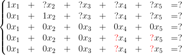
    
    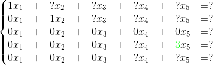
    
    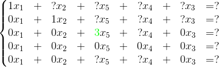
 
5. If there are no such elements in the whole bottom-left part of the linear system, you should end the first part of the algorithm.
    
    After all the manipulations in the first half of the algorithm, check the possibility of no solutions. It is possible when there is an all-zero row and a constant is not equal to zero. You can see the example below. In this case, a linear system contains a contradiction and therefore has no solution. In this case, you can end the algorithm.
 

 
Secondly, in the linear system the amount of variables and amount of equations don't need to be equal.
 
A number of significant equations is equal to the number of non-zero rows in the linear system. A number of significant variables is equal to the number of all columns in the linear system. After that, you can determine if the linear system has an infinite amount of solutions or a single one.
 
The following variants are possible:
 
1. The number of significant equations is equal to the number of significant variables. There is only one solution, you can find it like in the previous stage. Possible examples are shown below:
 
    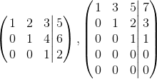
 
2. The number of significant equations is less than the number of significant variables. There is an infinite number of solutions. Possible examples are shown below:
 
    
    
    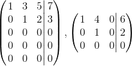
 
Note that there can't be a case in which the number of significant equations is greater than the number of significant variables because in this case there would be a contradiction we've handled in the previous steps of the algorithm.
 
In this stage you should write a program that handles all these nuances.
 
Write to file only `No solutions` or `Infinitely many solutions` if that's the case. If there is a single solution you should write to file only , , ..., , and every number should be on a separate line.
 
Don't forget that input can contain floating-point numbers.

